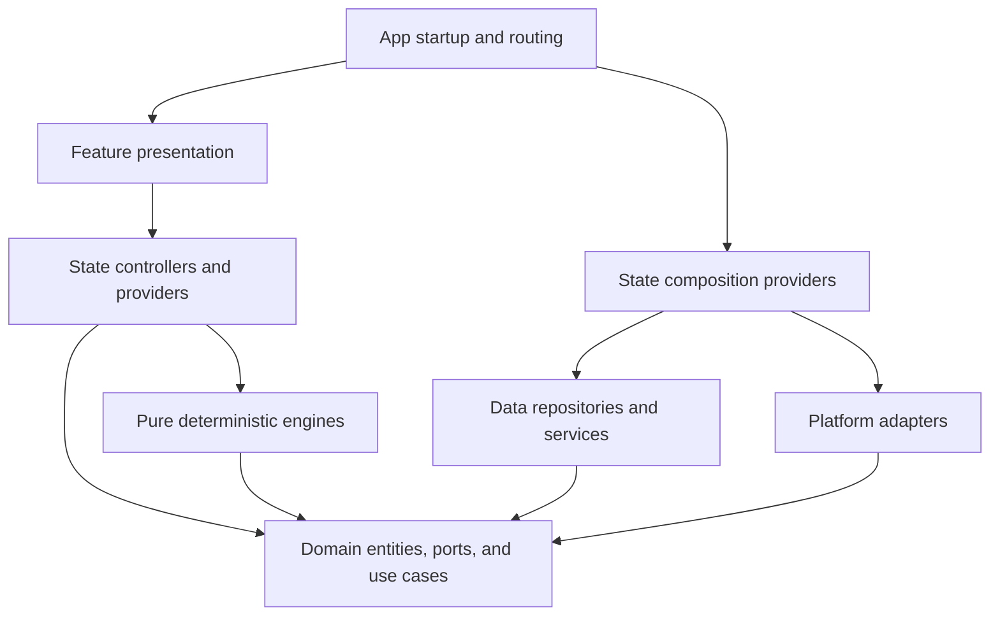

# ChronoSpark Layer Flow

ChronoSpark uses domain-centered dependency inversion. Runtime dependencies are
wired by Riverpod composition providers, while business contracts remain free
of Flutter, storage, network, and presentation types.

## Required dependency rules

- `domain/` owns business entities, repository interfaces, and platform ports.
  It must not import app, data, engine, feature, state, system, Flutter, or
  persistence implementations.
- `engine/` owns deterministic logic. It may use domain contracts but must not
  import feature, state, data, system, app, Flutter, or Riverpod layers.
- `data/` implements domain repositories and storage/network services. It must
  not own Riverpod providers or import feature/state presentation models.
- `system/` implements device and plugin-facing domain ports. It must not import
  feature, state, app, or engine code.
- `state/` owns orchestration and Riverpod state. The three composition files
  `repository_providers.dart`, `storage_providers.dart`, and
  `service_providers.dart` are the explicit wiring boundary allowed to create
  concrete data and system adapters.
- `features/` owns presentation and interaction. Its `ui/`, `widgets/`, and
  `screens/` code must reach persistence, network, engines, and platform APIs
  through state/domain contracts rather than concrete implementations.
- `app/` owns startup, navigation, and final dependency composition. Feature
  presentation receives validated routes and callbacks instead of importing
  app routing policy.

## Practical request path

1. A feature view dispatches an intent to a state controller/provider.
2. State invokes a domain use case or domain-owned port.
3. Composition providers supply the concrete data or system implementation.
4. Repositories/services map external data into domain values.
5. State publishes the result and the view re-renders.

## Automated enforcement

- `check_architecture.ps1` normalizes project-relative paths on every platform,
  parses single-line and multiline Dart imports, and fails closed on forbidden
  dependencies.
- `test/architecture/repository_ownership_checker_test.dart` exercises the live
  repository and negative fixtures for every protected dependency direction.
- `test/architecture/file_responsibility_contract_test.dart` keeps named
  coordinators and responsibility parts below the maintained size ceiling.
