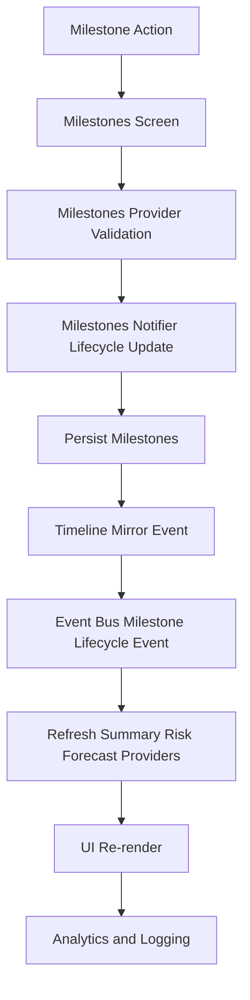

# Milestones FlowMap

## Trigger
User creates, updates, progresses, completes, archives, or removes a milestone.

## Diagram

## Flow
1. Milestone action starts from milestones UI or related command surface.
2. Milestones provider validates fields and lifecycle constraints.
3. Milestones notifier computes status transitions and timestamps.
4. Milestone set is persisted to storage.
5. Timeline mirror event is written for milestone lifecycle actions.
6. Event bus emits milestone lifecycle domain event.
7. Dependent providers refresh summary, risk, forecast, and health signals.
8. UI re-renders milestone lists, health, and risk sections.
9. Analytics/logging pathways consume resulting milestone/timeline signals.

## Data and Services
- Screen: milestones screen and milestone summaries
- Provider/Controller: milestones provider, milestone actions, milestone summary/risk/forecast providers
- Use case: timeline add event use case for mirrored lifecycle output
- Repository: milestone storage path inside milestones provider persistence
- Data sources: shared prefs storage + timeline repository
- Services: event bus, timeline provider, optional notification path via downstream consumers

## Errors
- Invalid milestone payload
- Persistence write failure
- Timeline mirror write failure

## Fallback
- Preserve in-memory milestone state during transient write failures
- Keep primary milestone mutation path non-blocking when timeline mirroring fails
- Retry persistence on next valid mutation

## Analytics Event
- milestone_created
- milestone_progress_updated
- milestone_completed
- milestone_archived
