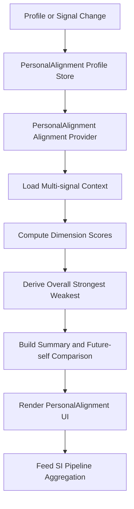

# PersonalAlignment FlowMap

## Trigger
PersonalAlignment profile changes, or upstream behavioral signals (tasks/goals/memories/timeline/milestones) change.

## Diagram

## Flow
1. User updates PersonalAlignment profile fields or system data changes in upstream providers.
2. PersonalAlignment profile store loads/saves authored profile state.
3. PersonalAlignment alignment provider gathers multi-signal context:
   - trajectory summary
   - goals
   - memories
   - tasks
   - timeline health/risk
   - milestone summary
   - core values alignment
   - synthetic soul state
4. Dimension scores are computed (purpose, identity, future self, vision, etc.).
5. Overall alignment, strongest area, and weakest area are derived.
6. Summary and future-self comparison providers generate final user-facing outputs.
7. UI surfaces render alignment, recommendations, and future-self gap.
8. SI pipeline consumes PersonalAlignment alignment as part of system intelligence aggregation.

## Data and Services
- Screen: personal alignment surfaces and SI summaries
- Provider/Controller: personal alignment profile/alignment/summary/future-self comparison providers
- Use case: provider-level computation pipeline (composed signal scoring)
- Repository: PersonalAlignment profile store wrapper over shared preferences
- Data sources: shared preferences + upstream provider state
- Services: synthetic soul layer, SI pipeline aggregation

## Errors
- Profile serialization/deserialization failure
- Upstream dependency provider failure

## Fallback
- Default to empty profile and baseline alignment
- Continue with partial context when one upstream source fails
- Preserve stable summary output with deterministic defaults

## Analytics Event
- personal_alignment_profile_updated
- personal_alignment_alignment_rendered
- personal_alignment_gap_reviewed

## Audit Checklist
- ../CORE_VALUES_PERSONAL ALIGNMENT_AUDIT.md
