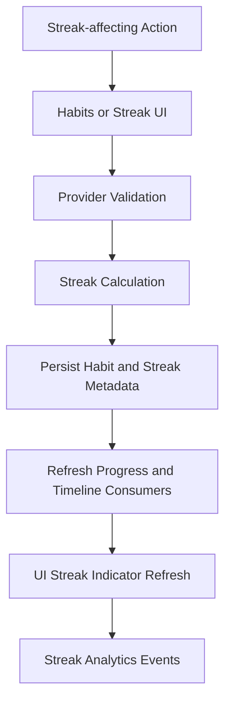

# Streaks FlowMap

## Trigger
A streak-affecting action occurs (habit completion, missed window, task cadence break).

## Diagram

## Flow
1. User completes or misses a streak-relevant action.
2. Habits/streak path validates identity and timestamp ordering.
3. Streak calculation derives current streak, best streak, and break/continuation status.
4. Habit/streak metadata is persisted.
5. Progress and timeline-aware providers consume updated streak state.
6. UI refreshes streak indicators and risk cues.
7. Streak lifecycle analytics are emitted.

## Data and Services
- Screen: habit and streak cards
- Provider/Controller: habits provider and streak-derived consumers
- Use case: streak computation in habit action flow
- Repository: habit repository
- Data sources: local persisted habits + optional sync
- Services: reminder orchestration, analytics, timeline consumers

## Errors
- Missing streak source record
- Invalid cadence window timestamp
- Persistence failure

## Fallback
- Keep previous streak state and surface retry
- Queue deferred reconciliation when storage/sync path fails

## Analytics Event
- streak_updated
- streak_broken
- streak_best_reached

## Related
- This flow is aligned with and complements Habit Streak details in habit_streak_flowmap.md.
